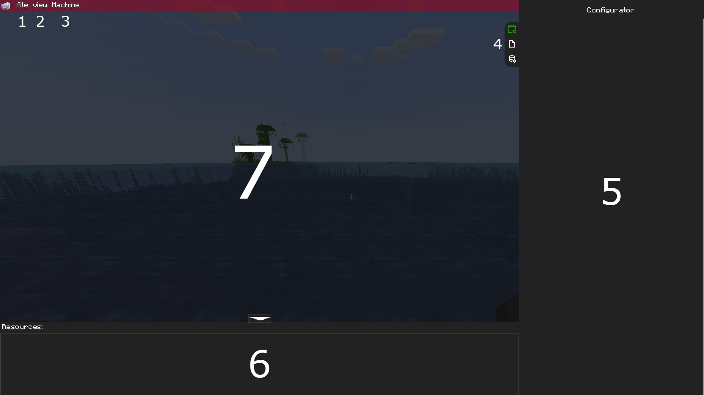

# How to use Multiblocked2

## Intro

Multiblocked2 is.. a pretty powerful mod, to say the least. Hell, some would even call it a ***tool*** rather than a mod.

It allows players to make pretty complex machines, multiblocks and recipes, with built-in compatibility for other major mods like Create, Gregtech Modern, Mekanism, and even Pneumaticcraft: Repressurised.

That being said, it has a **STEEP** learning curve, even with KilaBash's tutorial videos. I'm just making this guide to try and help myself and others understand the maddeningly powerful stuff that KilaBash has made.

Okay, intro over, let's get this started.

!!! note
    From this point on, this guide assumes the following constants:

    1. **You have a working installation of Forge for Minecraft 1.20.1 (preferably Version 47.3.0 or above).** If you don't, please download and install it from [Forge's official site](https://files.minecraftforge.net/net/minecraftforge/forge/index_1.20.1.html) or through your launcher of choice.
    2. **You know how to install mods.** It can be either manually, or through your launcher of choice, but as long as you know how to properly install mods in the environment you're working with, that's all you need to be concerned with.

## MBD2 and You

!!! info
    I ***highly*** reccommend installing [KubeJS](https://www.curseforge.com/minecraft/mc-mods/kubejs/) alongside Multiblocked2, as it makes loading resources a ***helluva*** lot easier in the long run. Plus, it allows for dynamically defining new recipes for recipe types - a subject that I'll cover later.

First, download and install the latest release of Multiblocked2 from <https://www.curseforge.com/minecraft/mc-mods/multiblocked2>.

Boot up your game, and make a new superflat world, with Creative mode & Cheats enabled. This will allow you to keep the development of your custom machines & multiblocks seperate from whatever main world you have.

Once you've loaded in, run the command `/mbd2_editor`. It should bring up the following GUI:

